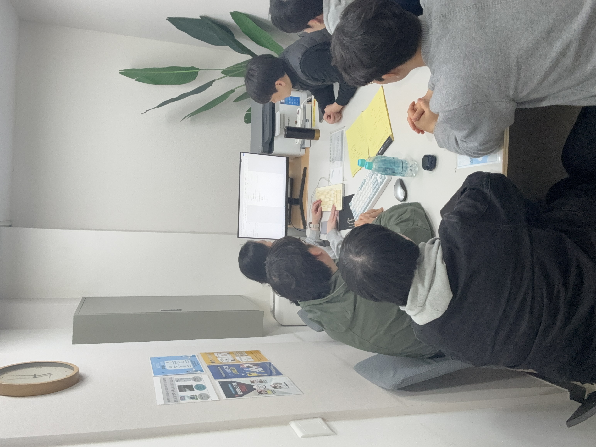
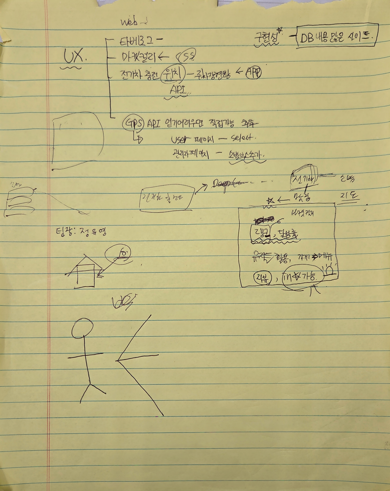
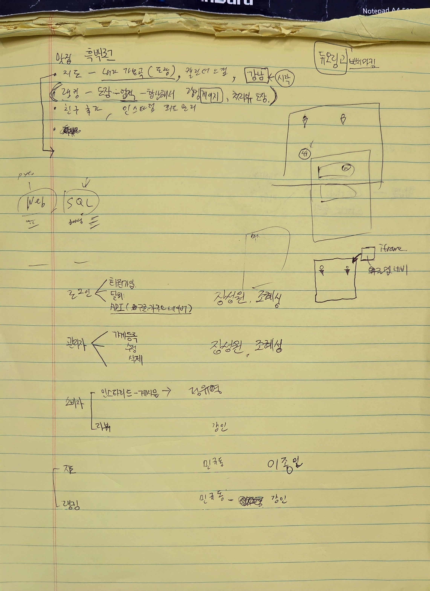

# [2026.03.06] 1차 회의록

## 팀 구성
- **팀장** : 정유영  
- **팀원** : 강인, 민규동, 이종민, 장성원, 조혜성  

---

# 1. 프로젝트 주제

## 흑백로그
음식점 리뷰 및 랭킹 시스템을 기반으로 한 서비스  

사용자가 음식점을 방문하고 **리뷰 및 도장을 기록하며 랭킹을 확인할 수 있는 플랫폼**

---

# 2. 주요 기능

## 2-1. 사용자 기능
- 음식점 리뷰 작성
- 음식점 방문 기록 및 도장 시스템
- 음식점 및 사용자 랭킹 확인
- 음식점 위치 지도 확인

## 2-2. 관리자 기능
- 음식점 등록
- 음식점 정보 수정
- 음식점 삭제

---

# 3. 역할 분담 (애자일 페어 프로그래밍)

## 3-1. 로그인 / 회원 관리
**담당** : 장성원, 조혜성  

### 기능
- 회원가입
- 회원탈퇴
- 소셜 로그인 API 연동  
  - Google  
  - Kakao  
  - Naver  

---

## 3-2. 관리자 페이지
**담당** : 장성원, 조혜성  

### 기능
- 음식점 등록
- 음식점 정보 수정
- 음식점 삭제

---

## 3-3. 소비자 기능
**담당** : 정유영, 강인  

### 기능
- 피드 게시물 작성  
  (Instagram 형태의 게시글 피드)

- 음식점 리뷰 작성  
  (Naver 리뷰 형태)

---

## 3-4. 지도 기능
**담당** : 민규동, 이종민  

### 기능
- 지도 기반 음식점 위치 표시
- 음식점 방문 도장 기록

---

## 3-5. 랭킹 시스템
**담당** : 민규동, 강인  

### 기능
- 음식점 랭킹
- 음식 도장 기반 랭킹
- 업적 기반 랭킹 시스템

---

# 4. 협업 툴
- **GitHub** : 버전 관리
- **Discord / Slack** : 팀 커뮤니케이션

---

# 5. 다음 회의 목표
- 시스템 설계를 위한 문서 작성
- UML 설계
- ERD 설계
- Use Case 작성

---

### 회의 사진
<!-- 이미지 추가 -->

