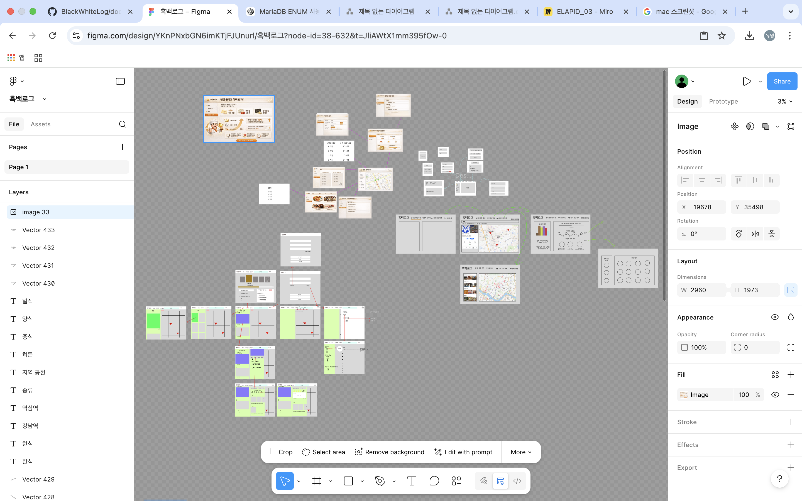
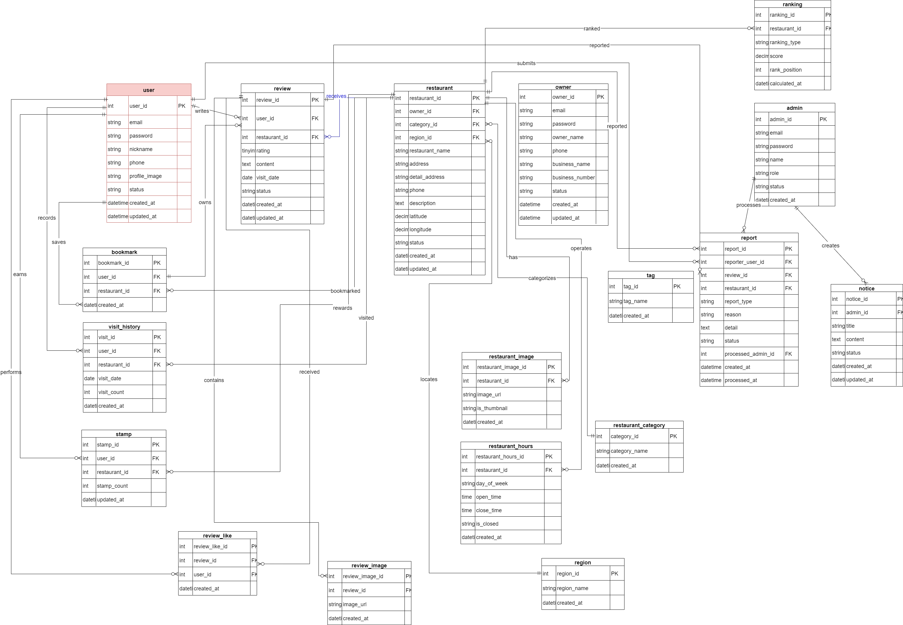
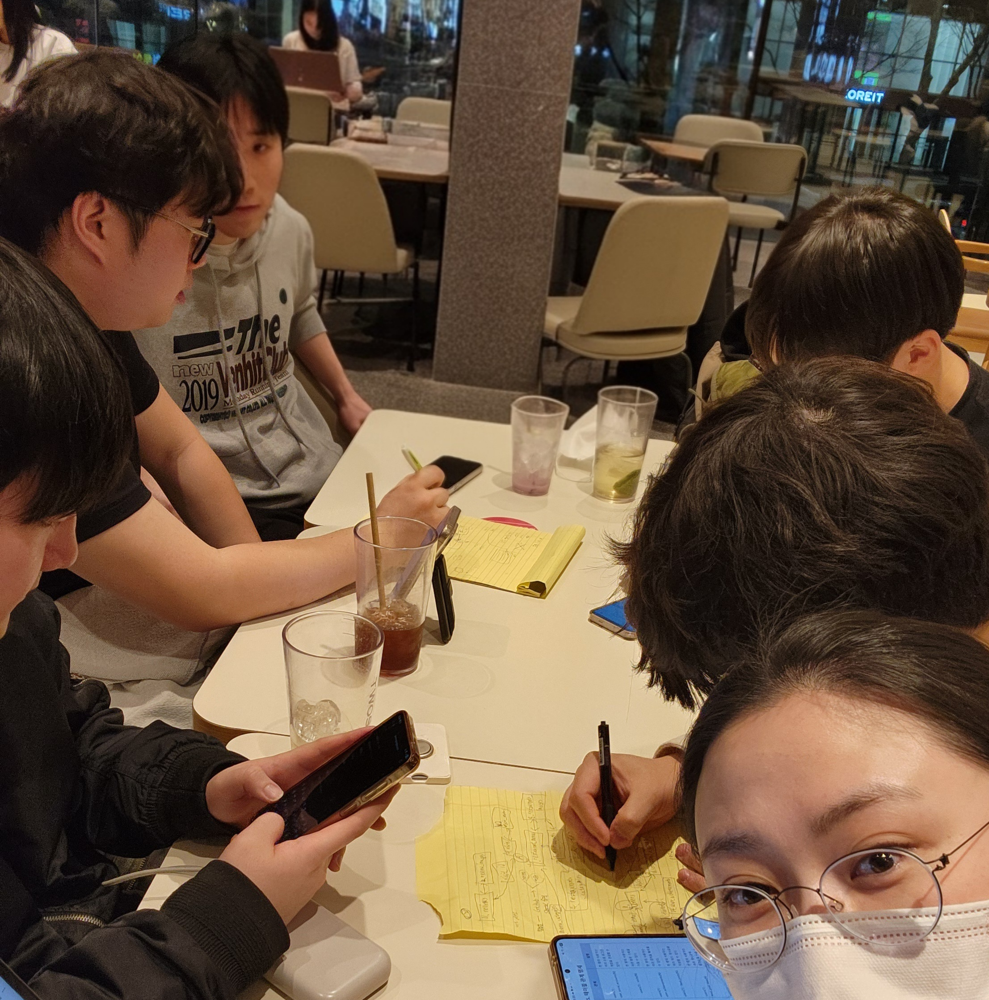

# [2026.03.09] 2차 회의록

## 1. 참여자
- 정유영
- 강인
- 민규동
- 이종민
- 장성원
- 조혜성

---

## 2. 주요 안건

**프로젝트 : 흑백로그**

- 프로젝트에 필요한 **UI 설계**
- 서비스 기능에 맞는 **페이지 구성 및 구조 설계**

---

## 3. 주요 작업 내용

### 3-1. UI 설계
- 서비스에 필요한 화면(UI) 구성
- 페이지 구조 및 기본 레이아웃 설계

### 3-2. 기능 세분화
- 주요 기능을 세부 기능 단위로 분리
- 각 기능의 역할 및 동작 정의

### 3-3. DB 설계
- 서비스 기능에 맞는 **데이터베이스 구조 설계**
- 테이블 및 관계 정의

---

## 4. 다음 회의 목표

- Class Diagram 설계
- Use Case 작성
- ERD 확인 및 수정

### 회의 사진
<!-- 이미지 추가 -->
