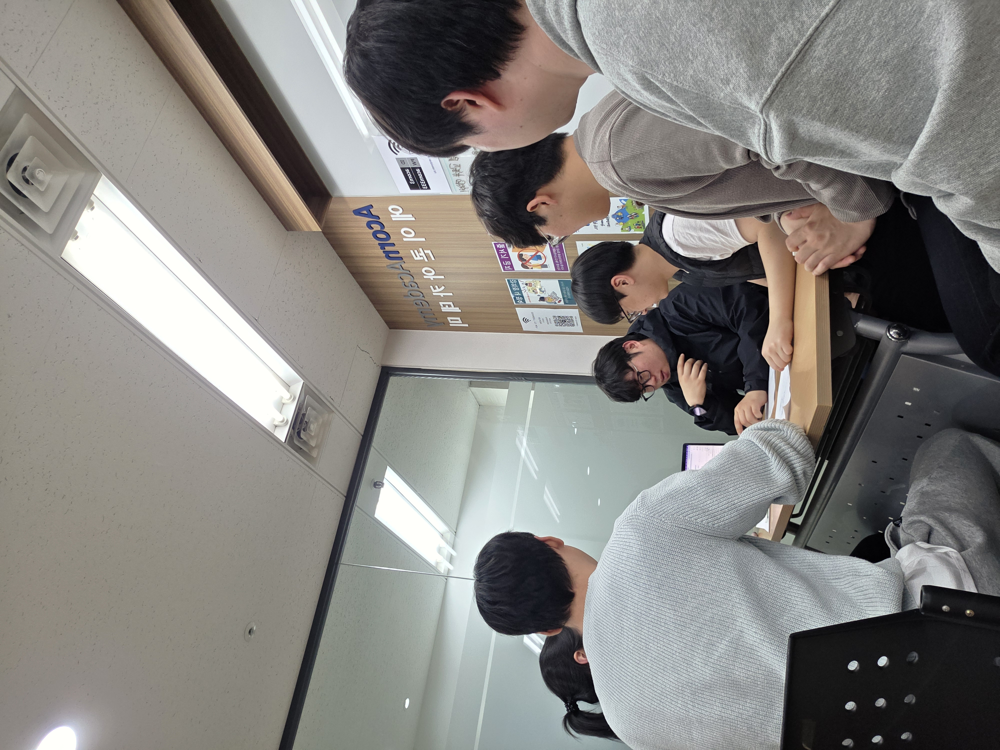
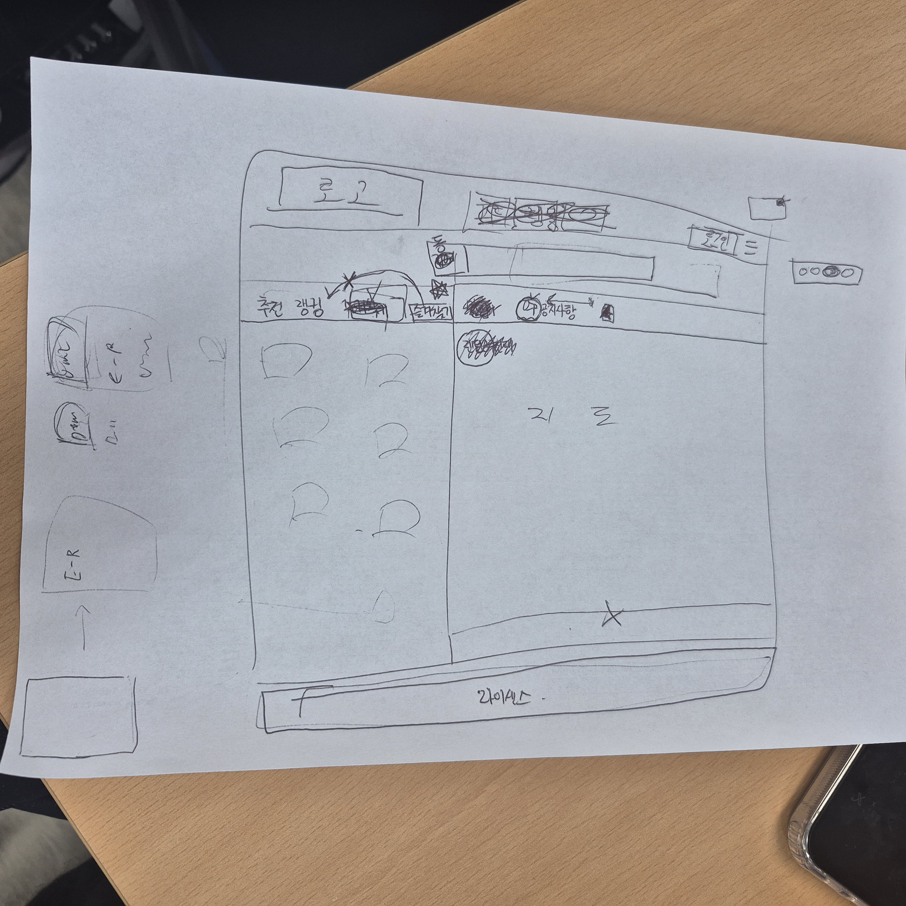

# [2026.03.10] 3차 회의록

## 1. 참여자
- 정유영
- 강인
- 민규동
- 이종민
- 장성원
- 조혜성

---

## 2. 완성된 안건

### 2-1. 설계 다이어그램
- ERD 생성 완료
- 추후 수정 가능

### 2-2. 담당 역할 추가 및 확정

#### 메인 UI 배치 및 전체 연동 관리
- 담당자 : 민규동

#### 어드민 페이지
- 기능 추가
- 계정 관리
- 클래스 정리 및 역할 이해
- UI 기능 최소화
- 담당자 : 조혜성, 장성원

#### 오너 페이지
- 판매자 페이지 등록
- 가게 등록
- 물품 등록
- 담당자 : 정유영, 이종민

#### 유저 페이지
- 로그인 페이지
- 로그인 API 연동 필요
  - 카카오
  - 네이버
  - 구글
- 마이페이지
- 개인정보 수정
- 개인정보 등록
- 회원탈퇴
- 담당자 : 장성원, 조혜성

#### 피드 페이지
- 인별그램처럼 사용하는 피드 공간 구성
- 담당자 : 정유영, 민규동

#### 랭킹 서비스
- Python 메인에서 point 결과값만 DB update
- 담당자 : 강인

#### 지도 API 및 도장 서비스
- 담당자 : 강인

### 2-3. 시스템 설정
- User 가입 후 Owner 등록 방식으로 진행
- 팝업창 최소화
- UI 생성 시 모바일 웹 이용자를 고려한 반응형 UI 적용

### 2-4. 현재 확인 사항
- 서버 연결 전까지 HTML 생성 시 VSCode Live Server로 화면 상태 확인
- 추후 GCP 서버 사용 확정

---

## 3. 다음 회의 목표
- GitHub 프로젝트 서버 연동
- DB 생성
- UI 디자인 최종 확정
- 검색 API 확인

### 회의 사진
<!-- 이미지 추가 -->

