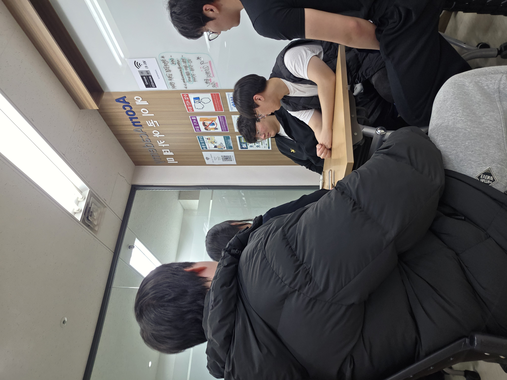

# [2026.03.11] 팀 회의록 (4차)

## 1. 참여자

- 정유영
- 강인
- 민규동
- 이종민
- 장성원
- 조혜성

## 2. 진행 및 완료 내용

- UI 디자인 구상 방향 통일
- 파일 경로 및 파일명 규칙 통일
- 고정 이미지는 `static` 폴더에 저장하기로 결정
- 업로드형 이미지는 클라우드 저장 방식으로 관리하기로 결정
- GitHub `fork`, `clone` 작업 완료

## 3. 추가 기능 및 담당자

- 레스토랑 카드: 강인
- 메뉴 기능: 강인
- 댓글(리뷰) 기능: 강인

## 4. 다음 회의 예정 안건

- 메인화면 랭킹 카드 위치 설정
- 레스토랑 메뉴 테이블에 이미지 컬럼 추가
- 오너페이지 관련 컬럼 추가
- Git branch 전략 및 정리

### 회의 사진
<!-- 이미지 추가 -->
