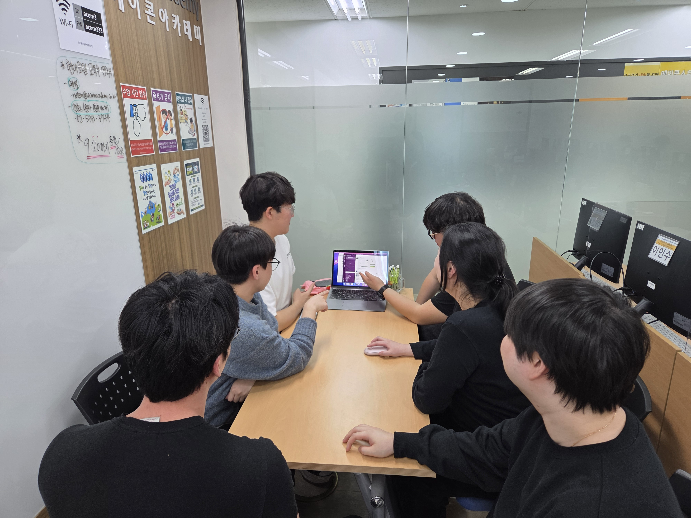

# [[2026.03.12] 팀 회의록 (5차)]
## 3줄 요약
- 사용자 페이지와 오너 페이지의 주요 UI 및 기능 구현이 대부분 완료되었습니다.
- 현재 관리자 페이지와 마이페이지 상세 기능 작업을 진행 중입니다.
- 다음 단계로 지도 DB 연동 기반 도장 기능과 예약 기능 논의를 이어갈 예정입니다.

---

## 1. 참여자

- 정유영
- 강인
- 민규동
- 이종민
- 장성원
- 조혜성

---

## 2. 완료 사항

- 로그인 UI 및 기능 구현
- 회원가입 UI 및 기능 구현
- 마이페이지 UI 구현
- 메인페이지 지도 API 및 핀 UI 및 기능 구현
- 오너페이지 가입 기능 구현
- 오너보드 UI 구현
- 리뷰관리 UI 구현
- 메뉴등록 UI 구현
- 공지사항관리 UI 구현
- 상점 패널, 정보, 댓글, 메뉴 영역 UI 및 구현

---

## 3. 진행 중

- 관리자 페이지 작업
- 마이페이지 상세 기능 작업

---

## 4. 추가 안건

- 우선 `visit`에 더미 데이터를 넣어 도장 기능 구현 예정

---

## 5. 할 예정

- 피드 기능은 강인 작업 후 판넬에 적용 예정
- merge 후 지도 DB 데이터 연동 완료
- 이후 지도 도장 작업 진행 예정

---

## 6. 다음 회의 안건

- 시간이 남을 경우 예약 기능 논의

---

### 회의 사진
<!-- 이미지 추가 -->

