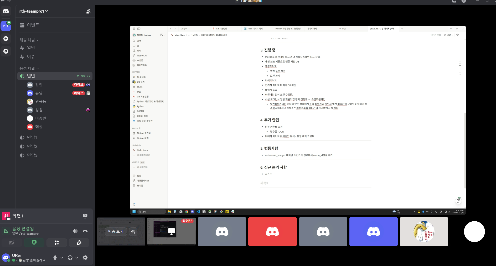

# [2026.03.14] 팀 회의록 (7차)

## 1. 참여자

- 정유영
- 강인
- 민규동
- 이종민
- 장성원
- 조혜성

---

## 2. 완료 사항

- 로그인 및 회원가입 기능 구현 완료
- 메인 보드 기준 댓글 사진 DB 연동 완료 (로컬 기준)
- 랭킹페이지 업데이트
  - 실시간 랭킹 반영
  - 대시보드 뱃지 작업
  - 업적 타이틀 작업
- 로그인, 회원가입 최종 테스트 완료
- 지도 API 및 지도 핀 작업 완료
- 오너페이지 메뉴 등록 페이지 작업 완료

---

## 3. 진행 중

- merge 후 회원가입, 로그인 정상 작동 확인 시 피드 작업 진행 예정
- 메인 보드 기준 댓글 사진 DB 작업
- 랭킹페이지 추가 작업
  - 랭킹 티어 점수
  - 도전 과제
- 마이페이지 작업
- 관리자 페이지 최종 DB 확인
- 페이지 AJAX 처리
- 회원가입 양식 조건 수정
- 소셜 로그인 연동 흐름 정리 및 구현
  - 일반 회원가입이 완료되지 않은 상태에서 소셜 회원가입 시도 시 일반 회원가입 단계로 이동
  - 소셜 API에서 제공하는 회원정보를 회원가입 양식에 자동 매핑

---

## 4. 추가 안건

- 방문 카운트 조건 논의
  - 영수증 OCR 연동 필요
- 판매자 페이지 판매 중 음식 수 카운트 시 품절 메뉴 제외 처리

---

## 5. 변동사항

- `restaurant_images` 테이블에 조인 키가 필요하여 `menu_id` 컬럼 추가

---

## 6. 3줄 요약

- 로그인, 회원가입, 지도 API, 지도 핀, 오너 메뉴 등록 페이지까지 주요 기능 구현 및 테스트를 완료했다.
- 현재는 피드, 댓글 사진 DB, 랭킹 추가 기능, 마이페이지, 관리자 페이지 DB 점검, AJAX 처리, 회원가입 조건 수정 작업을 진행 중이다.
- 추가로 영수증 OCR 기반 방문 카운트와 판매자 페이지의 품절 제외 음식 수 집계 방식, 그리고 `restaurant_images.menu_id` 컬럼 추가가 논의되었다.

### 회의 사진
<!-- 이미지 추가 -->
